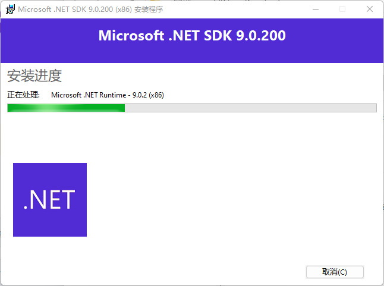

## cli

Download or Install the StateSmith CLI

There are two main ways to run the StateSmith CLI:

1. Download the pre-built binary for your computer (no need for dotnet, no need to install anything).
2. Install the StateSmith CLI using the dotnet SDK.

Follow [the instructions here](https://github.com/StateSmith/StateSmith/wiki/CLI:-Download-or-Install) for the method that you prefer.

### dotnet install

直接在命令行运行 dotnet 工具来安装的话，会报错：没找到兼容的 .NET SDK；

同时也列出了对应的下载网址：https://aka.ms/dotnet-download

```bash
dotnet tool install --global StateSmith.Cli

Could not execute because the application was not found or a compatible .NET SDK is not installed.
Possible reasons for this include:
  * You intended to execute a .NET program:
      The application 'tool' does not exist.
  * You intended to execute a .NET SDK command:
      It was not possible to find any installed .NET SDKs.
      Install a .NET SDK from:
        https://aka.ms/dotnet-download
```

我安装的是下面这个：



下载完成之后，power_shell 切换到对应的安装目录（可以使用 everything 搜索下 dotnet.exe 安装在了哪里）

```bash
(base) PS C:\Windows\system32> cd 'C:\Program Files (x86)\dotnet\'
(base) PS C:\Program Files (x86)\dotnet> ls


    目录: C:\Program Files (x86)\dotnet


Mode                 LastWriteTime         Length Name
----                 -------------         ------ ----
d-----        2022-01-09     13:55                host
d-----        2025-03-11     19:43                metadata
d-----        2025-03-11     19:43                packs
d-----        2025-03-11     20:45                sdk
d-----        2025-03-11     19:43                sdk-manifests
d-----        2025-03-11     19:44                shared
d-----        2025-03-11     20:46                swidtag
d-----        2025-03-11     20:46                templates
-a----        2025-01-16     21:53         130344 dotnet.exe
-a----        2021-11-17     18:23           9519 LICENSE.txt
-a----        2025-01-16     18:45          96177 ThirdPartyNotices.txt


(base) PS C:\Program Files (x86)\dotnet> .\dotnet.exe tool install --global StateSmith.Cli
已安装工具“statesmith.cli”。
(base) PS C:\Program Files (x86)\dotnet> .\dotnet.exe tool uninstall --global StateSmith.Cli
已成功卸载工具“statesmith.cli”(版本“0.17.5”).
(base) PS C:\Program Files (x86)\dotnet> .\dotnet.exe tool install --global StateSmith.Cli
可使用以下命令调用工具: ss.cli
已成功安装工具“statesmith.cli”(版本“0.17.5”)。
(base) PS C:\Program Files (x86)\dotnet>
```

